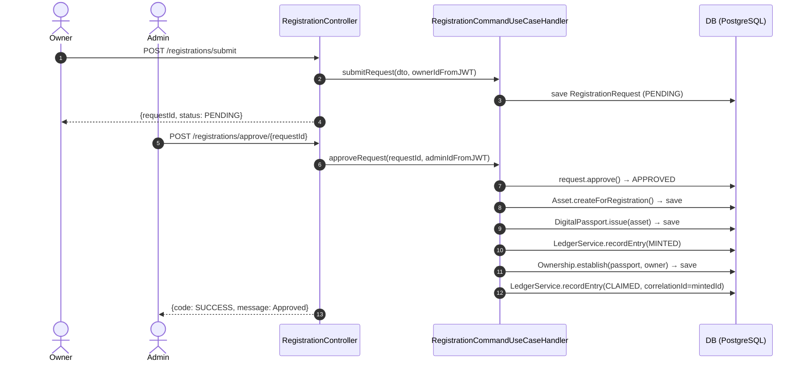
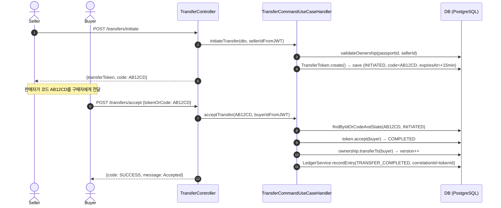

# Attestry DPP Backend — 최종 가이드 (MVP Edition)

> **읽는 법**: 처음 온 개발자라면 1 → 2 → 4 → 5 순서로 읽는다.
> 특정 기능을 구현·수정해야 한다면 2(API 목록) → 3(역할별 경로) → 4(기능 카드) 를 참고한다.

---

## 목차

1. [MVP 목표](#1-mvp-목표)
2. [전체 API 목록](#2-전체-api-목록)
3. [역할별 읽기 경로](#3-역할별-읽기-경로)
4. [기능 카드 (상세)](#4-기능-카드-상세)
5. [실전 시나리오](#5-실전-시나리오)
6. [도메인 상태 전이](#6-도메인-상태-전이)
7. [시퀀스 다이어그램](#7-시퀀스-다이어그램)
8. [에러 응답 표준](#8-에러-응답-표준)
9. [초보자용 디버깅 지도](#9-초보자용-디버깅-지도)
10. [개발 환경 체크리스트](#10-개발-환경-체크리스트)

---

## 1. MVP 목표

### 1.1 우리가 만드는 가치

| 문제 | 해결 |
|---|---|
| 위조·도난 우려가 큰 제품의 소유권 증명이 어렵다 | SHA-256 해시 체인 원장으로 변조 불가 이력 기록 |
| 소유권 이전이 구두·메시지에 의존한다 | 1회용 코드 기반 시스템 이전, 원장에 확정 기록 |
| 중고 거래 시 진품/소유권 검증이 느리다 | QR 코드로 공개 여권 즉시 조회 |

### 1.2 시스템 핵심 결과물

```
RegistrationRequest(PENDING)
       ↓ ADMIN 승인
    Asset  →  DigitalPassport  →  Ownership  →  LedgerEntry(MINTED + CLAIMED)
                    ↓ 소유권 이전
              Ownership(갱신)  →  LedgerEntry(TRANSFER_COMPLETED)
```

### 1.3 MVP 성공 기준

**등록 승인 시** — 하나의 트랜잭션 안에서 원자적으로 생성:
1. `Asset` (제품 엔티티)
2. `DigitalPassport` (디지털 여권)
3. `LedgerEntry` — `MINTED` (민팅 이벤트)
4. `Ownership` (소유권 투영)
5. `LedgerEntry` — `CLAIMED` (소유권 확정 이벤트)

**양도 수락 시** — 하나의 트랜잭션 안에서 원자적으로 갱신:
1. `TransferToken` → `COMPLETED`
2. `Ownership` 소유자 변경
3. `LedgerEntry` — `TRANSFER_COMPLETED` (또는 최초 클레임이면 `CLAIMED`)

---

## 2. 전체 API 목록

| 메서드 | 경로 | 역할 | 설명 |
|---|---|---|---|
| `POST` | `/api/v1/auth/signup` | 누구나 | 회원가입 |
| `POST` | `/api/v1/auth/login` | 누구나 | 로그인 (JWT 발급) |
| `GET` | `/api/v1/auth/status` | 인증 | 내 계정 상태 조회 |
| `GET` | `/api/v1/registrations/upload-url` | `OWNER` | 증빙 파일 업로드 pre-signed URL 발급 |
| `POST` | `/api/v1/registrations/submit` | `OWNER` | 등록 요청 제출 |
| `GET` | `/api/v1/registrations/my` | `OWNER` | 내 등록 요청 목록 |
| `GET` | `/api/v1/registrations/list` | `ADMIN` | 전체 등록 요청 목록 (페이지) |
| `POST` | `/api/v1/registrations/approve/{requestId}` | `ADMIN` | 등록 승인 → 민팅/여권/소유권/원장 생성 |
| `POST` | `/api/v1/registrations/reject/{requestId}` | `ADMIN` | 등록 거절 |
| `GET` | `/api/v1/passports/{qrPublicCode}` | 누구나 | QR 코드로 공개 여권 조회 |
| `GET` | `/api/v1/passports` | `OWNER` | 내 여권 목록 (페이지) |
| `POST` | `/api/v1/transfers/initiate` | 인증 | 양도 토큰 발급 |
| `POST` | `/api/v1/transfers/accept` | 인증 | 양도 수락 |
| `GET` | `/api/v1/transfers/token/{tokenId}` | 인증 | 토큰 상세 조회 |
| `POST` | `/api/v1/transfers/cancel/{tokenId}` | 인증 | 양도 취소 |
| `POST` | `/api/v1/services/submit` | `PROVIDER` | 서비스 케이스 등록 |
| `POST` | `/api/v1/services/{caseId}/complete` | `PROVIDER` | 서비스 완료 처리 |
| `POST` | `/api/v1/services/{caseId}/approve` | `OWNER` | 서비스 결과 승인 |
| `GET` | `/api/v1/services/{caseId}` | 인증 | 서비스 케이스 조회 |
| `POST` | `/api/v1/brands/mint` | `BRAND` | 브랜드 직접 민팅 |
| `POST` | `/api/v1/brands/release` | `BRAND` | 브랜드 출고 |
| `GET` | `/api/v1/admin/users/pending` | `ADMIN` | 승인 대기 사용자 목록 |
| `POST` | `/api/v1/admin/users/{userId}/approve` | `ADMIN` | 사용자 계정 승인 |
| `POST` | `/api/v1/admin/users/{userId}/reject` | `ADMIN` | 사용자 계정 거절 |
| `GET` | `/api/v1/stats/today` | `ADMIN` | 오늘 통계 |

---

## 3. 역할별 읽기 경로

### OWNER (소유자)

핵심 시나리오: 등록 요청 → 여권 발급 → 소유권 이전

```
코드 읽기 순서:
1. RegistrationController       → POST /registrations/submit, GET /registrations/my
2. PassportController           → GET /passports (내 여권 목록)
3. TransferController           → POST /transfers/initiate, POST /transfers/accept
4. RegistrationCommandUseCaseHandler.submitRequest()
5. TransferCommandUseCaseHandler.initiateTransfer() / acceptTransfer()
6. RegistrationRequest, TransferToken, Ownership, LedgerEntry
```

### ADMIN (관리자)

핵심 시나리오: 대기 목록 조회 → 승인 (민팅/여권/소유권/원장 원자 생성)

```
코드 읽기 순서:
1. RegistrationController       → GET /registrations/list, POST /registrations/approve/{id}
2. RegistrationCommandUseCaseHandler.approveRequest()
   ├─ Asset.createForRegistration(modelName, serialNumber, admin)
   ├─ DigitalPassport.issue(asset)
   ├─ LedgerService.recordEntry(MINTED)
   ├─ Ownership.establish(passport, owner)
   └─ LedgerService.recordEntry(CLAIMED)
3. AdminUserController          → 사용자 계정 승인/거절
```

### PROVIDER (서비스 업체)

핵심 시나리오: 서비스 접수 → 완료 처리 → 소유자 승인 대기

```
코드 읽기 순서:
1. ServiceController            → POST /services/submit, POST /services/{id}/complete
2. ServiceCaseCommandUseCaseHandler.submitService() / completeService()
3. ServiceCase (REQUESTED → COMPLETED → APPROVED/REJECTED)
```

### 신규 개발자 (첫 번째 날)

```
1. domain/model/ 전체 훑기 — 엔티티 구조 파악
2. 실전 시나리오 S1 (등록 → 승인) 읽기
3. RegistrationCommandUseCaseHandler.approveRequest() 한 줄씩 따라가기
4. Swagger UI (http://localhost:8080/swagger-ui.html) 로 API 직접 호출해보기
```

---

## 4. 기능 카드 (상세)

### 카드 A — 소유자 등록 요청 제출

| 항목 | 내용 |
|---|---|
| 엔드포인트 | `POST /api/v1/registrations/submit` |
| 권한 | `ROLE_OWNER` |
| 식별자 출처 | `requesterId` ← JWT (`JwtUserDetails.getUserId()`) |

**요청 바디:**
```json
{
  "modelName": "Gucci Marmont",
  "serialNumber": "GC-2026-0001",
  "evidenceUrls": "[\"https://minio/.../receipt.jpg\"]"
}
```

> `evidenceUrls`는 JSON 배열을 문자열로 직렬화한 값이다.
> 실제 파일 업로드는 `GET /registrations/upload-url?filename=receipt.jpg` 로 pre-signed URL을 받아 프론트에서 직접 PUT한다.

**내부 처리:**
1. 요청자(User) 존재 확인
2. `RegistrationRequest.submit(modelName, serialNumber, evidenceUrls, requesterId)` — ID 형식: `REQ-XXXXXXXX`
3. 상태 = `PENDING`

**성공 응답:**
```json
{
  "code": "SUCCESS",
  "message": "OK",
  "data": {
    "requestId": "REQ-A1B2C3D4",
    "modelName": "Gucci Marmont",
    "serialNumber": "GC-2026-0001",
    "status": "PENDING"
  }
}
```

**실패 시나리오:**
- 존재하지 않는 userId → `404 NOT_FOUND`
- DTO 유효성 오류 → `400 BAD_REQUEST`

---

### 카드 B — 관리자 등록 승인 (MVP 핵심)

| 항목 | 내용 |
|---|---|
| 엔드포인트 | `POST /api/v1/registrations/approve/{requestId}` |
| 권한 | `ROLE_ADMIN` |
| 식별자 출처 | `adminId` ← JWT |

**내부 처리 (단일 트랜잭션):**

```
1. RegistrationRequest 조회 → request.approve() → APPROVED
2. Asset.createForRegistration(modelName, serialNumber, admin)
   └─ status = ACTIVE (브랜드 민팅과 달리 바로 ACTIVE)
3. DigitalPassport.issue(asset)
   └─ ID 형식: P-XXXXXXXX, qrStatus = ACTIVE
4. LedgerService.recordEntry(passport, MINTED, "SYSTEM", "SYSTEM", dataJson, null)
5. Ownership.establish(passport, requester)
   └─ version = 0
6. LedgerService.recordEntry(passport, CLAIMED, "OWNER", requesterId, null, mintedLedgerId)
   └─ correlationId = MINTED 원장 항목의 ID (체인 연결)
```

**성공 응답:**
```json
{
  "code": "SUCCESS",
  "message": "Approved",
  "data": null
}
```

**실패 시나리오:**
- 이미 APPROVED/REJECTED → `400 BAD_REQUEST` ("이미 처리된 요청입니다.")
- 요청 없음 → `404 NOT_FOUND`

---

### 카드 C — 양도 발의

| 항목 | 내용 |
|---|---|
| 엔드포인트 | `POST /api/v1/transfers/initiate` |
| 권한 | 인증된 사용자 (소유자 여부는 내부 검증) |
| 식별자 출처 | `fromUserId` ← JWT |

**요청 바디:**
```json
{
  "passportId": "P-A1B2C3D4",
  "method": "ONE_TIME_CODE",
  "receiptNumber": "RCP-2026-0101",
  "evidenceUrls": "[\"https://...\"]"
}
```

**내부 처리:**
1. Passport 존재 확인
2. Ownership 조회 → `isOwnedBy(fromUserId)` 검증 (소유자 불일치 시 `400`)
3. `TransferToken.create(passport, fromUser, method, receiptNumber, evidenceUrls)`
   - 만료: 15분 (`expiresAt = now + 15min`)
   - `ONE_TIME_CODE` 선택 시 6자리 코드 자동 생성
   - `@Version` 낙관적 잠금으로 동시 수락 방지

**성공 응답:**
```json
{
  "code": "SUCCESS",
  "message": "OK",
  "data": {
    "transferToken": "tr_a1b2c3d4",
    "code": "AB12CD"
  }
}
```

---

### 카드 D — 양도 수락 (MVP 핵심)

| 항목 | 내용 |
|---|---|
| 엔드포인트 | `POST /api/v1/transfers/accept` |
| 권한 | 인증된 사용자 |
| 식별자 출처 | `toUserId` ← JWT |

**요청 바디:**
```json
{
  "tokenOrCode": "AB12CD"
}
```

> `tokenOrCode`에는 토큰 ID(`tr_...`) 또는 1회용 코드(`AB12CD`) 모두 입력 가능하다.
> 내부에서 `findByIdOrCodeAndState(tokenOrCode, INITIATED)` 단일 쿼리로 조회한다.

**내부 처리 (단일 트랜잭션):**
```
1. INITIATED 상태 토큰 조회 (토큰 ID 또는 1회용 코드로)
2. token.accept(toUser)
   ├─ failedAttempts >= 5 → IllegalStateException (잠금)
   ├─ state != INITIATED → IllegalStateException
   └─ expiresAt < now → IllegalStateException (만료)
3. Ownership.transferTo(toUser) → version++
4. LedgerService.recordEntry(
     action: token.isFirstClaim() ? CLAIMED : TRANSFER_COMPLETED
     correlationId: token.getId()
   )
```

> **최초 클레임 vs 일반 양도**: `fromUser == null` 이면 최초 클레임(`CLAIMED`),
> 소유자 → 소유자 이전이면 `TRANSFER_COMPLETED`.

**실패 시 동작:** `IllegalStateException` 발생 시 `failedAttempts` 를 +1 하고 DB에 반영 후 `400` 반환.

**성공 응답:**
```json
{
  "code": "SUCCESS",
  "message": "Accepted",
  "data": null
}
```

---

### 카드 E — QR 공개 여권 조회

| 항목 | 내용 |
|---|---|
| 엔드포인트 | `GET /api/v1/passports/{qrPublicCode}` |
| 권한 | **인증 불필요** (누구나 QR로 조회 가능) |

**응답 주요 필드:**
- `passportId`, `qrPublicCode`, `modelName`, `isGenuine`
- `currentOwnerName` (마스킹된 이름)
- `since` (현재 소유 시작일)
- `ledgerEvents` — 전체 원장 이력 (날짜, 액션, 해시 앞 8자리, 행위자)

---

### 카드 F — 서비스 케이스 흐름

| 단계 | 엔드포인트 | 권한 | 설명 |
|---|---|---|---|
| 접수 | `POST /api/v1/services/submit` | `PROVIDER` | 수리/인증 케이스 등록 |
| 완료 | `POST /api/v1/services/{caseId}/complete` | `PROVIDER` | 서비스 완료 처리 |
| 승인 | `POST /api/v1/services/{caseId}/approve` | `OWNER` | 소유자 결과 승인 |

> 소유자 거절은 현재 구현에 없음 (PROVIDER ID는 JWT에서 추출).

---

## 5. 실전 시나리오

### S1 — 소유자 자가등록 → 관리자 승인 → 여권 발급

#### Step 1. 증빙 파일 업로드 URL 발급

```http
GET /api/v1/registrations/upload-url?filename=receipt.jpg
Authorization: Bearer <owner-jwt>
```

응답:
```json
{
  "code": "SUCCESS",
  "data": "https://minio:9000/bucket/receipt.jpg?X-Amz-Expires=900&..."
}
```

프론트는 이 URL로 직접 PUT 업로드 (백엔드 경유 없음, 15분 유효).

#### Step 2. 등록 요청 제출

```http
POST /api/v1/registrations/submit
Authorization: Bearer <owner-jwt>
Content-Type: application/json

{
  "modelName": "Gucci Marmont",
  "serialNumber": "GC-2026-0001",
  "evidenceUrls": "[\"https://minio:9000/bucket/receipt.jpg\"]"
}
```

응답:
```json
{
  "code": "SUCCESS",
  "data": { "requestId": "REQ-A1B2C3D4", "status": "PENDING" }
}
```

#### Step 3. 관리자 승인

```http
POST /api/v1/registrations/approve/REQ-A1B2C3D4
Authorization: Bearer <admin-jwt>
```

승인 시 내부에서 원자적으로 실행:
- `Asset` (ASSET-XXXXXXXX) 생성
- `DigitalPassport` (P-XXXXXXXX) 생성
- `LedgerEntry` MINTED 기록
- `Ownership` 소유자 = 요청자, version = 0
- `LedgerEntry` CLAIMED 기록 (correlationId = MINTED 항목 ID)

응답:
```json
{ "code": "SUCCESS", "message": "Approved", "data": null }
```

#### Step 4. 내 여권 확인

```http
GET /api/v1/passports?page=0&size=10
Authorization: Bearer <owner-jwt>
```

방금 승인된 제품이 목록에 나타난다.

---

### S2 — 소유권 이전 (1회용 코드)

#### Step 1. 판매자 양도 발의

```http
POST /api/v1/transfers/initiate
Authorization: Bearer <seller-jwt>
Content-Type: application/json

{
  "passportId": "P-A1B2C3D4",
  "method": "ONE_TIME_CODE",
  "receiptNumber": "RCP-2026-0101",
  "evidenceUrls": "[\"https://...\"]"
}
```

응답:
```json
{
  "code": "SUCCESS",
  "data": {
    "transferToken": "tr_a1b2c3d4",
    "code": "AB12CD"
  }
}
```

판매자는 코드 `AB12CD`를 구매자에게 전달한다.

#### Step 2. 구매자 수락

```http
POST /api/v1/transfers/accept
Authorization: Bearer <buyer-jwt>
Content-Type: application/json

{ "tokenOrCode": "AB12CD" }
```

내부 처리:
- `TransferToken` → `COMPLETED`
- `Ownership.transferTo(buyer)` → version++
- `LedgerEntry` TRANSFER_COMPLETED 기록

응답:
```json
{ "code": "SUCCESS", "message": "Accepted", "data": null }
```

결과: 구매자가 새 소유자. QR 조회 시 원장 이력에 이전 기록이 나타난다.

---

### S3 — QR 코드로 제품 진품 확인 (인증 불필요)

```http
GET /api/v1/passports/QRAB12CD
```

응답:
```json
{
  "code": "SUCCESS",
  "data": {
    "passportId": "P-A1B2C3D4",
    "qrPublicCode": "QRAB12CD",
    "modelName": "Gucci Marmont",
    "isGenuine": true,
    "currentOwnerName": "김**",
    "since": "2026-03-01",
    "ledgerEvents": [
      { "date": "2026-03-01", "action": "MINTED",   "hash": "a1b2c3d4...", "actorName": "SYSTEM" },
      { "date": "2026-03-01", "action": "CLAIMED",  "hash": "e5f6g7h8...", "actorName": "김**" }
    ]
  }
}
```

---

## 6. 도메인 상태 전이

### RegistrationRequest

```
PENDING ──approve()──→ APPROVED
PENDING ──reject()───→ REJECTED
APPROVED/REJECTED → (변경 불가, IllegalStateException)
```

### TransferToken

```
INITIATED ──accept(toUser)──→ COMPLETED
INITIATED ──cancel()────────→ CANCELLED
COMPLETED/CANCELLED → (변경 불가)

제약:
- failedAttempts >= 5 → 잠금 (수락 불가)
- expiresAt < now    → 만료 (수락 불가)
```

### ServiceCase

```
REQUESTED ──complete()──────→ COMPLETED
COMPLETED ──approve(owner)──→ APPROVED
COMPLETED ──reject(owner)───→ REJECTED
REQUESTED → approve/reject (금지, IllegalStateException)
```

### Asset

```
MINTED ──release()──→ RELEASED
ACTIVE  (자가등록 승인 경로: 처음부터 ACTIVE)
RELEASED/ACTIVE → release() (금지)
```

### User

```
PENDING ──approve()──→ ACTIVE
PENDING ──reject()───→ REJECTED
(BRAND, RETAIL만 PENDING으로 가입, 나머지는 바로 ACTIVE)
```

---

## 7. 시퀀스 다이어그램

### S1 — 등록 승인 → 민팅/여권/소유권/원장



### S2 — 소유권 이전



---

## 8. 에러 응답 표준

### 응답 형식

```json
{ "code": "에러코드", "message": "설명", "data": null }
```

### HTTP 상태 코드 → 도메인 예외 매핑

| HTTP | 예외 클래스 | 발생 상황 |
|---|---|---|
| `400` | `BadRequestException` | 상태 전이 위반, 유효하지 않은 요청, 소유자 불일치 |
| `401` | `UnauthorizedException` | 소유권 없음, 인증 실패 |
| `404` | `NotFoundException` | 엔티티 없음 |
| `409` | `ConflictException` | 중복 충돌 (이미 진행 중인 양도 등) |
| `400` | Bean Validation 실패 | DTO `@NotBlank`, `@NotNull` 위반 |

### 자주 보는 에러와 원인

| 메시지 | 원인 |
|---|---|
| "이미 처리된 요청입니다." | APPROVED/REJECTED 상태에서 approve/reject 재시도 |
| "해당 여권의 소유자가 아닙니다." | 양도 발의 시 소유자 검증 실패 |
| "유효하지 않은 이전 토큰/코드입니다." | 토큰이 INITIATED 상태가 아니거나 존재하지 않음 |
| "시도 횟수 초과로 이전이 잠금되었습니다." | failedAttempts >= 5 |
| "이전 토큰이 만료되었습니다." | 발급 후 15분 초과 |

---

## 9. 초보자용 디버깅 지도

API 호출이 실패했을 때 이 순서로 확인한다.

```
1. JWT가 있는가?
   → Authorization: Bearer <token> 헤더 확인
   → 없으면: 401 Unauthorized

2. 역할이 맞는가?
   → @PreAuthorize("hasRole('OWNER')") 확인
   → 맞지 않으면: 403 Forbidden

3. DTO 유효성이 통과했는가?
   → @Valid + @NotBlank/@NotNull 확인
   → 실패 시: 400 + validation 메시지

4. 엔티티가 존재하는가?
   → requestId, passportId, userId 값이 DB에 있는지 확인
   → 없으면: 404 NotFoundException

5. 도메인 상태 전이가 올바른가?
   → 현재 상태가 허용된 전이인지 [6. 도메인 상태 전이] 표 확인
   → 아니면: 400 BadRequestException (IllegalStateException 변환)

6. 에러 응답 code/message를 읽어라.
   → GlobalExceptionHandler가 모든 예외를 처리한다.
```

---

## 10. 개발 환경 체크리스트

### 최초 설정

```bash
# 1. 인프라 시작
docker-compose up -d

# 2. 빌드
./gradlew clean build

# 3. 실행
./gradlew bootRun

# 4. 확인
open http://localhost:8080/swagger-ui.html
```

### 인프라

| 서비스 | 주소 | 자격증명 |
|---|---|---|
| PostgreSQL 15 | `localhost:5432` / DB: `attestry_dpp` | `postgres / password` |
| Minio API | `localhost:9000` | `minioadmin / minioadmin` |
| Minio 콘솔 | `localhost:9001` | `minioadmin / minioadmin` |
| Spring Boot | `localhost:8080` | — |
| Swagger UI | `localhost:8080/swagger-ui.html` | 인증 불필요 |

### 개발 계정 (DevDataSeeder 자동 생성)

| 역할 | 이메일 | 비밀번호 |
|---|---|---|
| `ADMIN` | kimsunwook@naver.com | adminsw00@ |
| `BRAND` | brand@test.com | brand123! |
| `OWNER` | owner@test.com | owner123! |
| `PROVIDER` | provider@test.com | provider123! |

### 테스트 실행

```bash
# 전체 테스트 (H2 인메모리 DB 사용)
./gradlew test

# 특정 클래스만
./gradlew test --tests "com.attestry.dpp.application.usecase.command.RegistrationCommandUseCaseHandlerTest"
```

### 운영 이관 전 체크포인트

- [ ] `JWT_SECRET` 환경변수 설정 (기본값 제거)
- [ ] `CORS_ALLOWED_ORIGINS` 운영 도메인으로 설정
- [ ] 로그인 잠금을 Redis 기반으로 전환 (현재: ConcurrentHashMap, 단일 서버 전용)
- [ ] 프론트/백엔드 enum 동기화 최종 확인 (`LedgerAction`, `TransferState`, `RegistrationStatus`)
- [ ] Minio 버킷 정책 검토 (public/private)
