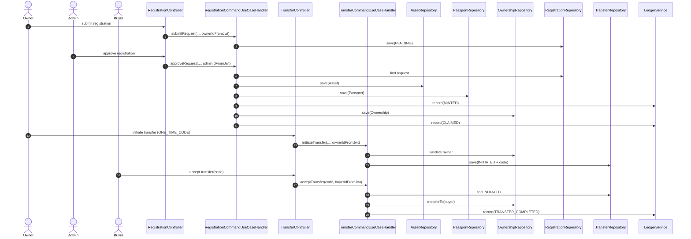

# Attestry DPP Backend Final Guide (MVP Edition)

이 문서는 1차 MVP 목표를 기준으로, 초보자도 "왜/어떻게 동작하는지"를 한 번에 이해하게 만드는 최종 문서입니다.

MVP 핵심 목표:
- 소유자가 직접 등록 요청(제품명, 시리얼, 영수증/증빙)을 올린다.
- 관리자가 승인하면 그 시점에 민팅되고 디지털 여권이 발급된다.
- 동시에 소유권이 확정되고 원장(ledger) 이벤트가 생성된다.
- 기존 소유자는 1회용 코드(또는 토큰)를 발급해 구매자에게 전달한다.
- 구매자가 수락하면 소유권이 이전되고 원장이 갱신된다.

---

## 1. MVP 한 장 요약

## 1.1 우리가 실제로 만드는 사용자 가치
- 위조/도난 우려가 큰 제품의 신뢰 가능한 이력 관리
- 소유권 이전을 메시지/구두가 아닌 시스템 기록으로 확정
- 중고 거래 시 "진품/소유권" 검증 속도 향상

## 1.2 시스템 결과물
- Digital Passport (제품 단위)
- Ownership Projection (현재 소유자)
- Ledger Chain (이력 이벤트 체인)

## 1.3 MVP 성공 기준
- 등록 승인 시 아래 4개가 원자적으로 만들어져야 함
1. Asset 생성
2. DigitalPassport 생성
3. Ownership 생성
4. LedgerEntry(MINTED + CLAIMED) 생성

- 양도 수락 시 아래 2개가 반드시 반영돼야 함
1. Ownership 소유자 변경
2. LedgerEntry(TRANSFER_COMPLETED 또는 CLAIMED) 생성

---

## 2. 역할별 읽기 경로 (요청하신 1번)

## 2.1 OWNER (소유자)
당신이 보는 핵심 기능:
1. 등록 요청 제출
- `POST /api/v1/registrations/submit`
2. 내 등록 요청 조회
- `GET /api/v1/registrations/my`
3. 내 여권 조회
- `GET /api/v1/passports`
4. 양도 시작
- `POST /api/v1/transfers/initiate`
5. 양도 수락(구매자 입장일 때)
- `POST /api/v1/transfers/accept`

읽을 코드 순서:
1. `RegistrationController`, `TransferController`, `PassportController`
2. `RegistrationCommandUseCaseHandler`, `TransferCommandUseCaseHandler`, `PassportQueryUseCaseHandler`
3. `RegistrationRequest`, `TransferToken`, `Ownership`, `LedgerEntry`

## 2.2 ADMIN (관리자)
당신이 보는 핵심 기능:
1. 대기 등록 목록
- `GET /api/v1/registrations/list`
2. 등록 승인
- `POST /api/v1/registrations/approve/{requestId}`
3. 등록 거절
- `POST /api/v1/registrations/reject/{requestId}`

읽을 코드 순서:
1. `RegistrationController`
2. `RegistrationCommandUseCaseHandler.approveRequest/rejectRequest`
3. `Asset`, `DigitalPassport`, `Ownership`, `LedgerService`

## 2.3 BRAND (브랜드)
MVP 외 확장 축이지만 현재 코드 존재:
- `POST /api/v1/brands/mint`
- `POST /api/v1/brands/release`

## 2.4 PROVIDER (서비스 업체)
MVP 외 확장 축이지만 현재 코드 존재:
- `POST /api/v1/services/submit`
- `POST /api/v1/services/{caseId}/complete`
- `POST /api/v1/services/{caseId}/approve`

---

## 3. 기능 카드형 정리 (요청하신 2번)

아래는 모든 핵심 기능을 동일 템플릿으로 정리한 카드입니다.

## 3.1 카드 A: 소유자 등록 요청 제출
- 목적: 소유자가 제품 소유 증빙을 제출
- 엔드포인트: `POST /api/v1/registrations/submit`
- 권한: `ROLE_OWNER`
- 입력: `modelName`, `serialNumber`, `evidenceUrls`
- 식별자 출처: `requesterId`는 JWT에서만 추출
- 검증:
1. 요청자(User) 존재 확인
2. DTO 유효성 검증
- 상태 변화:
1. `RegistrationRequest` 생성
2. 상태 = `PENDING`
- 성공 응답: `ApiResponse<RegistrationRequestResponse>`
- 실패 예시:
1. 사용자 없음 -> `NOT_FOUND`
2. 입력 오류 -> `VALIDATION_FAILED`

## 3.2 카드 B: 관리자 승인 (MVP 핵심)
- 목적: 등록 요청을 승인하여 디지털 자산화 수행
- 엔드포인트: `POST /api/v1/registrations/approve/{requestId}`
- 권한: `ROLE_ADMIN`
- 식별자 출처: `adminId`는 JWT
- 검증:
1. 요청 존재 확인
2. 요청자/관리자 존재 확인
3. 요청 상태가 `PENDING`인지 확인
- 상태/데이터 변화(트랜잭션):
1. `request.approve()` -> `APPROVED`
2. `Asset` 생성
3. `DigitalPassport` 생성
4. `Ledger(MINTED)` 기록
5. `Ownership.establish()`
6. `Ledger(CLAIMED)` 기록
- 성공 응답: `ApiResponse<Void>`
- 실패 예시:
1. 이미 처리됨 -> `BAD_REQUEST`
2. 요청 없음 -> `NOT_FOUND`

## 3.3 카드 C: 양도 시작
- 목적: 판매자가 구매자에게 전달할 1회용 코드/토큰 발급
- 엔드포인트: `POST /api/v1/transfers/initiate`
- 권한: 인증 사용자(실질적으로 소유자 검증)
- 입력: `passportId`, `method`, `receiptNumber`, `evidenceUrls`
- 식별자 출처: `fromUserId`는 JWT
- 검증:
1. passport 존재 확인
2. 요청 사용자 존재 확인
3. ownership 현재 소유자 일치 확인
- 상태 변화:
1. `TransferToken(INITIATED)` 생성
2. code(ONE_TIME_CODE 시) 발급
- 성공 응답: `ApiResponse<TransferInitiateResponse>` (`transferToken`, `code`)

## 3.4 카드 D: 양도 수락 (MVP 핵심)
- 목적: 구매자가 코드/토큰으로 소유권 확정 이전
- 엔드포인트: `POST /api/v1/transfers/accept`
- 입력: `tokenOrCode`
- 식별자 출처: `toUserId`는 JWT
- 검증:
1. INITIATED 상태 토큰 조회
2. 토큰 만료/실패횟수 제한 검증
3. 수락자(User) 존재 확인
- 상태/데이터 변화:
1. `transfer.accept(toUser)` -> `COMPLETED`
2. Ownership 소유자 변경
3. Ledger 이벤트 기록
: 최초 클레임이면 `CLAIMED`, 일반 양도면 `TRANSFER_COMPLETED`
- 성공 응답: `ApiResponse<Void>`

---

## 4. 도메인 상태 전이 표 (요청하신 3번)

## 4.1 RegistrationRequest
| 현재 상태 | 이벤트 | 다음 상태 | 허용 여부 |
|---|---|---|---|
| PENDING | approve() | APPROVED | 허용 |
| PENDING | reject() | REJECTED | 허용 |
| APPROVED | approve()/reject() | - | 금지 |
| REJECTED | approve()/reject() | - | 금지 |

금지 전이 시: `IllegalStateException` -> `BadRequestException` 변환

## 4.2 TransferToken
| 현재 상태 | 이벤트 | 다음 상태 | 허용 여부 |
|---|---|---|---|
| INITIATED | accept(toUser) | COMPLETED | 허용 |
| INITIATED | cancel() | CANCELLED | 허용 |
| COMPLETED | accept/cancel | - | 금지 |
| CANCELLED | accept/cancel | - | 금지 |

추가 제약:
- 만료(15분)면 수락 금지
- 실패 5회 초과면 잠금

## 4.3 ServiceCase
| 현재 상태 | 이벤트 | 다음 상태 | 허용 여부 |
|---|---|---|---|
| REQUESTED | complete() | COMPLETED | 허용 |
| COMPLETED | approve(owner) | APPROVED | 허용 |
| COMPLETED | reject(owner) | REJECTED | 허용 |
| REQUESTED | approve/reject | - | 금지 |

## 4.4 Asset
| 현재 상태 | 이벤트 | 다음 상태 | 허용 여부 |
|---|---|---|---|
| MINTED | release() | RELEASED | 허용 |
| RELEASED/ACTIVE | release() | - | 금지 |

---

## 5. 실전 시나리오 (요청하신 4번)

## 5.1 시나리오 S1: 소유자 자가등록 -> 관리자 승인 -> 민팅/여권/소유권/원장 생성

### Step 1. OWNER 등록 요청
요청:
```http
POST /api/v1/registrations/submit
Authorization: Bearer <owner-jwt>
Content-Type: application/json

{
  "modelName": "Gucci Marmont",
  "serialNumber": "GC-2026-0001",
  "evidenceUrls": "[\"https://minio/.../receipt.jpg\"]"
}
```

응답(요약):
```json
{
  "code": "SUCCESS",
  "message": "OK",
  "data": {
    "requestId": "REQ-...",
    "status": "PENDING"
  }
}
```

### Step 2. ADMIN 승인
요청:
```http
POST /api/v1/registrations/approve/REQ-...
Authorization: Bearer <admin-jwt>
```

승인 직후 내부에서 실행되는 핵심:
1. `RegistrationRequest` -> `APPROVED`
2. `Asset` 생성
3. `DigitalPassport` 생성
4. Ledger `MINTED`
5. `Ownership` 생성
6. Ledger `CLAIMED`

응답:
```json
{
  "code": "SUCCESS",
  "message": "Approved",
  "data": null
}
```

### Step 3. OWNER 내 여권 조회
요청:
```http
GET /api/v1/passports?page=0&size=10
Authorization: Bearer <owner-jwt>
```

결과:
- 방금 승인된 제품이 디지털 여권 목록에 나타남

## 5.2 시나리오 S2: 소유권 이전 (1회용 코드)

### Step 1. 판매자(현재 OWNER) 양도 시작
요청:
```http
POST /api/v1/transfers/initiate
Authorization: Bearer <seller-jwt>
Content-Type: application/json

{
  "passportId": "P-...",
  "method": "ONE_TIME_CODE",
  "receiptNumber": "RCP-2026-0101",
  "evidenceUrls": "[\"https://...\"]"
}
```

응답:
```json
{
  "code": "SUCCESS",
  "message": "OK",
  "data": {
    "transferToken": "tr_...",
    "code": "AB12CD"
  }
}
```

판매자는 이 코드를 구매자에게 전달.

### Step 2. 구매자 수락
요청:
```http
POST /api/v1/transfers/accept
Authorization: Bearer <buyer-jwt>
Content-Type: application/json

{
  "tokenOrCode": "AB12CD"
}
```

내부 처리:
1. 토큰 유효성 확인(INITIATED/만료/실패횟수)
2. `TransferToken` -> `COMPLETED`
3. Ownership 소유자 변경
4. Ledger `TRANSFER_COMPLETED` 기록

응답:
```json
{
  "code": "SUCCESS",
  "message": "Accepted",
  "data": null
}
```

결과:
- 구매자가 새로운 현재 소유자
- 이전 이력은 원장으로 추적 가능

---

## 6. MVP 기준 시퀀스 다이어그램



---

## 7. API 계약 표준

### 7.1 공통 응답 포맷
성공:
```json
{ "code": "SUCCESS", "message": "OK", "data": {} }
```

실패:
```json
{ "code": "BAD_REQUEST", "message": "...", "data": null }
```

### 7.2 보안 규칙
- 인증 필요 API는 JWT 필수
- role 기반 인가: `@PreAuthorize`
- 민감 식별자(body/query) 금지, JWT에서 추출

---

## 8. 초보자용 디버깅 지도

문제가 생기면 이 순서로 보면 됩니다.
1. JWT가 들어왔는가? (`Authorization`)
2. 역할이 맞는가? (`hasRole`)
3. DTO validation 실패인가?
4. 도메인 상태 전이 실패인가?
5. 예외 응답 `code/message`는 무엇인가?

---

## 9. 현재 코드와 MVP 목표의 일치성 체크

요청하신 MVP 흐름과 현재 구현은 다음이 일치합니다.
- OWNER 등록 요청 -> ADMIN 승인 -> 민팅/여권/소유권/원장 생성: 일치
- OWNER 양도 시작(1회용 코드) -> BUYER 수락 -> 소유권 이전/원장 반영: 일치

주의 포인트:
- 운영 확장 시 로그인 잠금은 Redis 기반으로 전환 권장
- 프론트/백엔드 enum 동기화는 릴리즈 전 최종 점검 필요

---

## 10. 결론

이 MVP는 "등록 승인 시점 디지털 자산화"와 "코드 기반 소유권 이전"이라는 핵심 목표를 코드 구조와 데이터 흐름으로 충족합니다.

실무적으로는 이미 서비스 가능한 설계이며,
다음 단계는 운영성(분산 잠금/계약 테스트/모니터링) 강화입니다.
